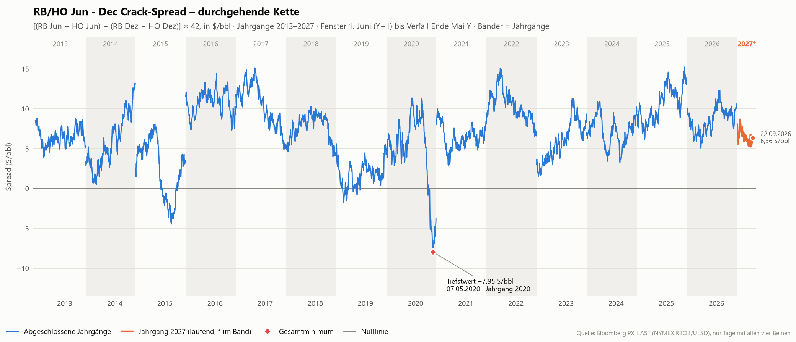
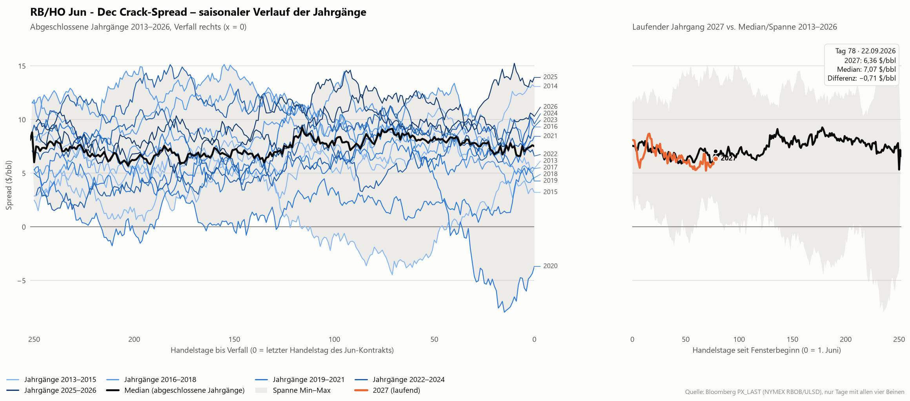
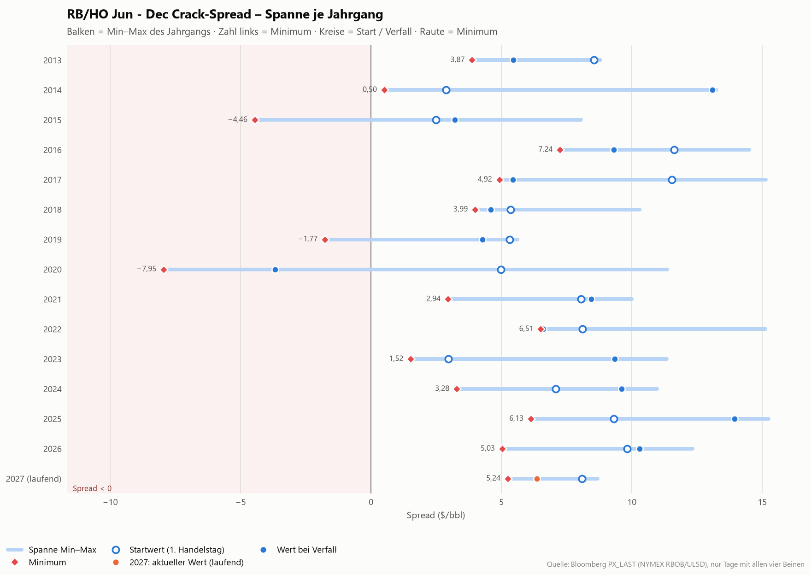
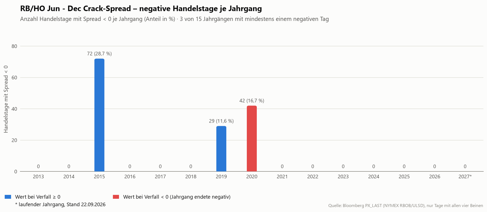
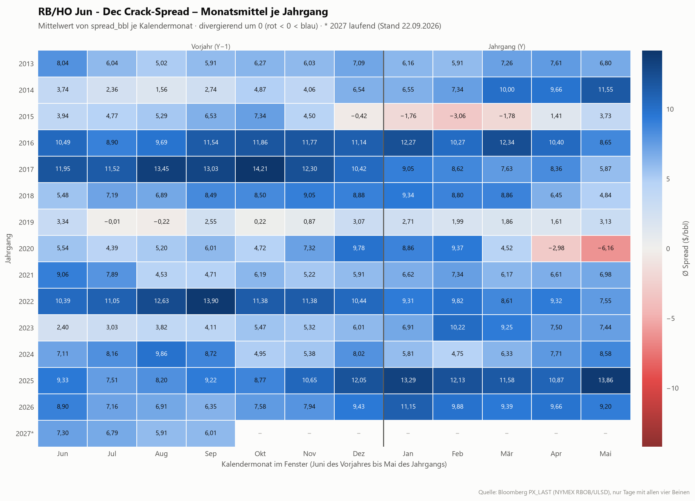

# RB/HO Jun - Dec Crack-Spread – Analyse der Jahrgänge

Stand der Daten: 22.09.2026 · erstellt am 22.09.2026 · 14 abgeschlossene Jahrgänge, Jahrgang 2027 laufend · Einheit $/bbl

## Kernaussagen

- **Tiefster Stand der gesamten Historie:** -7,95 $/bbl am 07.05.2020 (Jahrgang 2020) – der Spread war dort negativ, der Dezember-Crack also reicher als der Juni-Crack.
- **3 von 15 Jahrgängen** notierten an mindestens einem Handelstag unter null (2015, 2019, 2020); 1 davon endete bei Verfall negativ. Die längste zusammenhängende Negativphase dauerte 65 Handelstage (Jahrgang 2015).
- **Typisches Niveau:** zu Fensterbeginn im Median 7,57 $/bbl (Spanne 2,49 bis 11,63), bei Verfall im Median 7,52 $/bbl (Mittel 7,13; Spanne -3,68 bis 13,93). Über das Fenster baut der Spread damit typischerweise 0,05 $/bbl ab.
- **Zeitpunkt des Minimums:** im Median 133 Handelstage vor Verfall (Spanne 7 bis 240); in 5 von 14 Jahrgängen fiel das Minimum in die letzten 20 Handelstage. Das Jahrgangsminimum liegt im Mittel bei 2,27 $/bbl (Median 3,58).
- **In den letzten 20 Handelstagen vor Verfall** veränderte sich der Spread im Median um 1,49 $/bbl (positiv in 10 von 14 Jahrgängen).
- **Rückgang vom Zwischenhoch:** im Median 7,15 $/bbl, maximal 19,32 $/bbl (Jahrgang 2020).
- **Laufender Jahrgang 2027** (Stand 22.09.2026, Handelstag 78 seit Fensterbeginn): 6,36 $/bbl, das sind 0,71 $/bbl unter dem historischen Median am gleichen Handelstag (7,07 $/bbl); 6 von 14 abgeschlossenen Jahrgängen lagen zu diesem Zeitpunkt tiefer. Bisheriges Minimum: 5,24 $/bbl am 09.09.2026.
- **Höchststand:** 15,25 $/bbl am 15.05.2025 (Jahrgang 2025).

## Methodik

- **Formel:** `spread_bbl = [(RB_JunY − HO_JunY) − (RB_DecY − HO_DecY)] × 42` in $/bbl. RB = NYMEX RBOB Gasoline (Bloomberg-Root XB), HO = NYMEX NY Harbor ULSD (Bloomberg-Root HO), beide in $/gal; 42 gal = 1 bbl. Positiv bedeutet: der Juni-Gasoline-Crack ist reicher als der Dezember-Crack (normale Sommer-Fahrsaison-Saisonalität).
- **Fenster eines Jahrgangs Y:** 1. Juni (Y−1) bis zum letzten Handelstag des Jun-Kontrakts, d. h. dem letzten NYMEX-Geschäftstag im Mai Y (CME Rulebook Ch. 191/150; Achtung Memorial Day). Das tatsächliche Fensterende wird aus den Daten genommen (letzter Tag mit Preis im Jun-Bein). Die Fenster überlappen nicht; die Kette ist lückenlos.
- **Jahrgänge:** 2013 bis 2026 abgeschlossen, 2027 läuft seit 01.06.2026. Datenstand: 01.06.2012 bis 22.09.2026.
- **ULSD-Bruch:** Ab dem Mai-2013-Kontrakt ist HO = ULSD (< 15 ppm Schwefel). Der Handel der ULSD-Spezifikation begann am 29.04.2012, das Fenster ab 01.06.2012 (Jahrgang 2013) ist damit vollständig ULSD; ältere Jahrgänge (Heizöl 2000 ppm) werden nicht verglichen.
- **Datenquelle:** Bloomberg, Feld PX_LAST (Settlement) der 60 Kontrakte (4 Beine × 15 Jahrgänge, z. B. `XBM13 Comdty`, `HOM13 Comdty`, `XBZ13 Comdty`, `HOZ13 Comdty`).
- **Inner-Join-Regel:** In die Kette gehen nur Handelstage ein, an denen alle vier Beine einen Preis haben. Tage mit fehlendem Bein entfallen ersatzlos (keine Interpolation, kein Vortragen).
- **Kennzahlen:** `tdays_to_expiry` = verbleibende Handelstage im Fenster (0 am letzten Handelstag); `tday_index` = Handelstage seit Fensterbeginn (0 am ersten Tag). Negative Tage = Handelstage mit `spread_bbl < 0`; längste Negativserie in Handelstagen; max. Drawdown = größter Rückgang vom laufenden Hoch innerhalb des Fensters (≥ 0).
- **Laufender Jahrgang:** Da der Verfall noch nicht bekannt ist, wird der laufende Jahrgang nicht auf der Achse „Handelstage bis Verfall“ gezeigt, sondern auf „Handelstage seit Fensterbeginn“ und dort mit Median und Spanne der abgeschlossenen Jahrgänge am gleichen Handelstag verglichen.
- **Darstellung:** Zahlen mit 2 Dezimalstellen und Dezimalkomma, Datumsangaben als TT.MM.JJJJ; Anteil negativer Tage = negative Tage / Handelstage des Fensters.

## Kennzahlen je Jahrgang

| Jahrgang | Fenster | Tage | Start | Verfall | Minimum (Datum) | Maximum (Datum) | Neg. Tage | Anteil neg. | Längste neg. Serie | Max. Drawdown |
|:---|:---|---:|---:|---:|---:|---:|---:|---:|---:|---:|
| 2013 | 01.06.2012 – 31.05.2013 | 252 | 8,56 | 5,45 | 3,87 (02.08.2012) | 8,80 (13.06.2012) | 0 | 0,0 % | 0 | 4,93 |
| 2014 | 03.06.2013 – 30.05.2014 | 251 | 2,89 | 13,08 | 0,50 (20.08.2013) | 13,25 (29.05.2014) | 0 | 0,0 % | 0 | 4,73 |
| 2015 | 02.06.2014 – 29.05.2015 | 251 | 2,49 | 3,21 | -4,46 (17.02.2015) | 8,06 (15.10.2014) | 72 | 28,7 % | 65 | 12,52 |
| 2016 | 01.06.2015 – 31.05.2016 | 252 | 11,63 | 9,31 | 7,24 (02.05.2016) | 14,50 (12.01.2016) | 0 | 0,0 % | 0 | 7,25 |
| 2017 | 01.06.2016 – 31.05.2017 | 252 | 11,53 | 5,43 | 4,92 (17.05.2017) | 15,14 (17.10.2016) | 0 | 0,0 % | 0 | 10,22 |
| 2018 | 01.06.2017 – 30.05.2018 | 251 | 5,35 | 4,58 | 3,99 (09.05.2018) | 10,30 (01.12.2017) | 0 | 0,0 % | 0 | 6,31 |
| 2019 | 01.06.2018 – 31.05.2019 | 251 | 5,31 | 4,28 | -1,77 (27.07.2018) | 5,62 (05.06.2018) | 29 | 11,6 % | 12 | 7,39 |
| 2020 | 03.06.2019 – 29.05.2020 | 251 | 4,99 | -3,68 | -7,95 (07.05.2020) | 11,37 (06.12.2019) | 42 | 16,7 % | 37 | 19,32 |
| 2021 | 01.06.2020 – 28.05.2021 | 250 | 8,05 | 8,44 | 2,94 (26.08.2020) | 10,00 (08.06.2020) | 0 | 0,0 % | 0 | 7,06 |
| 2022 | 01.06.2021 – 31.05.2022 | 253 | 8,10 | 6,60 | 6,51 (19.05.2022) | 15,12 (09.09.2021) | 0 | 0,0 % | 0 | 8,62 |
| 2023 | 01.06.2022 – 31.05.2023 | 250 | 2,97 | 9,35 | 1,52 (14.06.2022) | 11,34 (27.02.2023) | 0 | 0,0 % | 0 | 5,33 |
| 2024 | 01.06.2023 – 31.05.2024 | 252 | 7,09 | 9,60 | 3,28 (29.01.2024) | 10,97 (05.09.2023) | 0 | 0,0 % | 0 | 7,69 |
| 2025 | 03.06.2024 – 30.05.2025 | 250 | 9,31 | 13,93 | 6,13 (26.07.2024) | 15,25 (15.05.2025) | 0 | 0,0 % | 0 | 5,74 |
| 2026 | 02.06.2025 – 29.05.2026 | 250 | 9,82 | 10,30 | 5,03 (10.09.2025) | 12,32 (23.01.2026) | 0 | 0,0 % | 0 | 5,02 |
| 2027 (laufend) | 01.06.2026 – 22.09.2026 | 79 | 8,09 | 6,36 * | 5,24 (09.09.2026) | 8,69 (24.06.2026) | 0 | 0,0 % | 0 | 3,45 |

Alle Werte in $/bbl. * = letzter verfügbarer Wert des laufenden Jahrgangs (kein Verfall). Anteil neg. = negative Handelstage / Handelstage des Fensters.

## Charts

Interaktive Version aller Charts (Hover, Zoom, Legende zum Ein-/Ausblenden): [Interaktives Dashboard](dashboard.html)

### Durchgehende Kette seit Juni 2012

*Durchgehende Kette aller Jahrgänge. Bänder markieren die Fenster (1. Juni Y−1 bis Verfall Ende Mai Y), die Linie ist an den Jahrgangsgrenzen unterbrochen, weil dort das Kontraktpaar wechselt. Der laufende Jahrgang ist orange, das Gesamtminimum rot markiert.*

### Saisonaler Vergleich der Jahrgänge

*Links: abgeschlossene Jahrgänge auf der Achse „Handelstage bis Verfall“ (Verfall rechts), mit Median (schwarz) und Min–Max-Spanne (grau). Rechts: der laufende Jahrgang auf der Achse „Handelstage seit Fensterbeginn“ gegen Median und Spanne der abgeschlossenen Jahrgänge auf derselben Achse.*

### Spanne je Jahrgang: Start, Minimum, Verfall

*Je Jahrgang die Spanne zwischen Minimum und Maximum, dazu Startwert (offener Kreis), Wert bei Verfall (gefüllter Kreis) und Minimum (Raute). Der rot hinterlegte Bereich liegt unter null.*

### Negative Handelstage je Jahrgang

*Anzahl der Handelstage mit negativem Spread je Jahrgang (Anteil an allen Handelstagen des Fensters in Klammern). Rot: Jahrgänge, deren Wert bei Verfall negativ war.*

### Monatsmittel je Jahrgang

*Mittlerer Spread je Kalendermonat des Fensters (Juni des Vorjahres bis Mai des Jahrgangs), divergierend um null: blau positiv, rot negativ.*

## Datenqualität

- Quelle: synthetic_export.xlsx, 42498 Preiszeilen, 60 Ticker.

- Zeitraum: 01.06.2012 bis 22.09.2026, 3.595 Handelstage mit vollständigen Daten, 15 Jahrgänge.
- Fehlende Spread-Werte in der Kette: 0.
- Handelstage je abgeschlossenem Jahrgang: 250 bis 253 (Median 251).
- Keine Lücken > 5 Kalendertage zwischen aufeinanderfolgenden Handelstagen.
- Doppelte Handelstage: 0.
